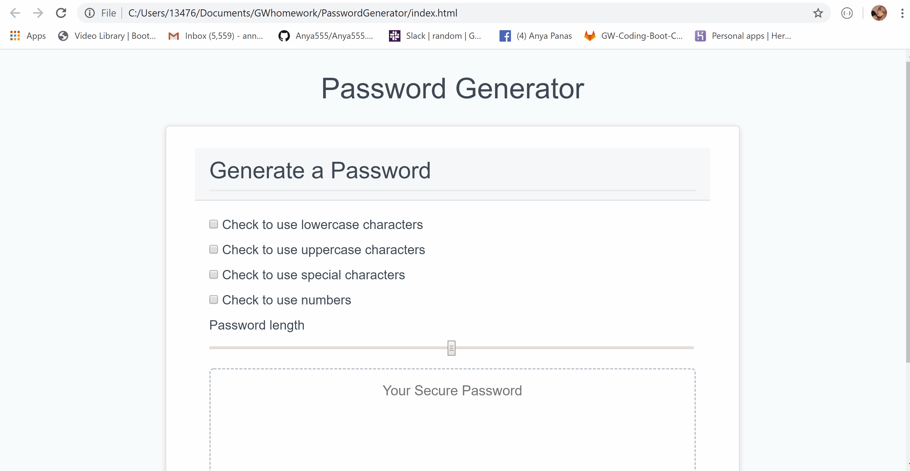

#PasswordGenerator

Password generator is a an application that generates a random password based on user-selected criteria.

* APP FLOW: 

The user is prompted to choose from the following password criteria:

- Length (must be between 8 and 128 characters)
- Character type:
- Special characters (see examples)
- Numeric characters
- Lowercase characters
- Uppercase characters

User will be alerted to chose at least one criteria if nonde selected. Once all prompts are answered, the user is  presented with a password matching the answered prompts. User also has an ability to copy a password to a clipboard.

